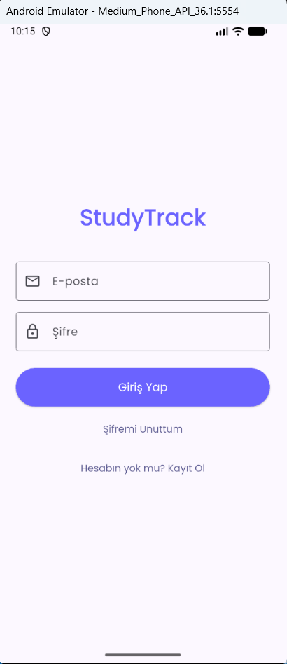
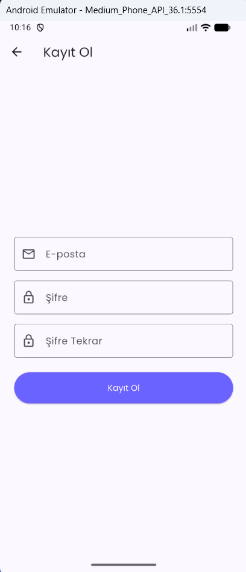
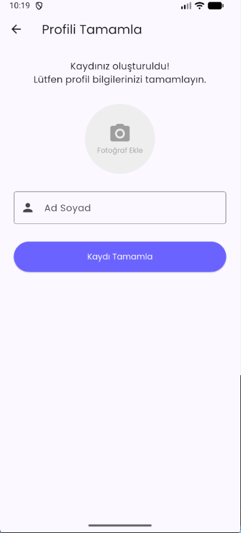
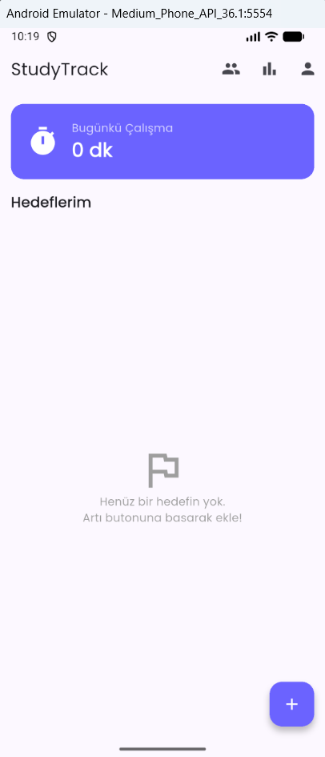
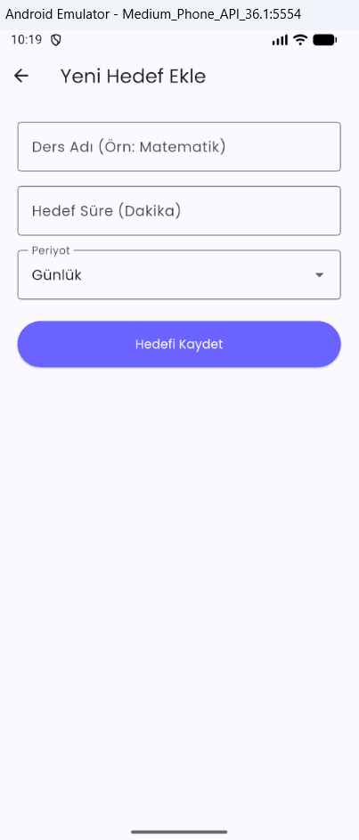
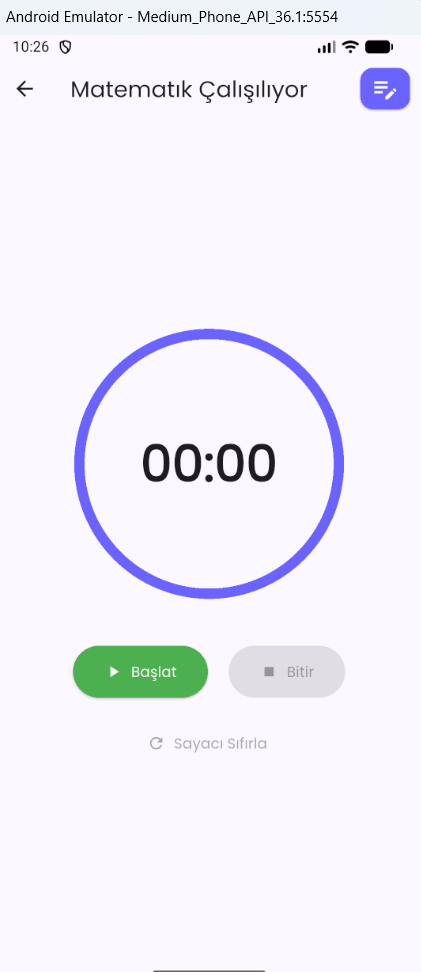
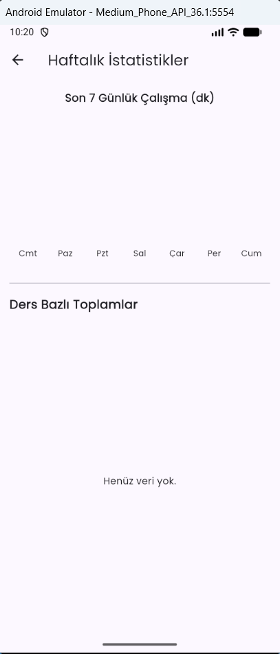
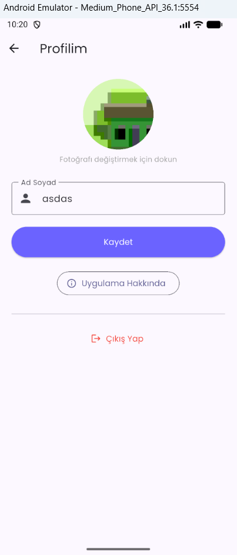
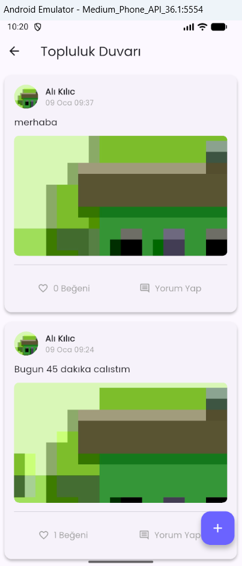

# StudyTrack - Çalışma Takip Uygulaması

## Proje Raporu

Ali Kılıç - 22060325

### 1. Projenin Amacı

StudyTrack, öğrencilerin çalışma süreçlerini takip etmelerini, hedefler belirlemelerini ve çalışma motivasyonlarını artırmalarını sağlayan mobil bir uygulamadır. 

**Ana Özellikler:**
-  Ders bazlı hedef belirleme (günlük/haftalık)
-  Çalışma sürelerini zamanlayıcı ile takip etme
-  Manuel çalışma süresi girişi
-  Haftalık ve ders bazlı istatistikler
-  Topluluk duvarı (paylaşım, yorum, beğeni)
-  Kullanıcı profili yönetimi
-  Firebase Authentication ile güvenli giriş
-  Türkçe dil desteği

### 2. Kullanılan Teknolojiler

#### Frontend Framework
- **Flutter**
- **Dart**

#### Backend & Veritabanı
- **Firebase Authentication**
- **Cloud Firestore**
- **Firebase Storage**

#### State Management & UI
- **Provider ^6.1.0** - State management
- **Google Fonts ^6.3.3** - Poppins font ailesi
- **FL Chart ^1.1.1** - Grafik ve istatistik görselleştirme
- **flutter_localizations** - Türkçe yerelleştirme desteği

#### Diğer Paketler
- **intl ^0.20.2** - Tarih formatlama ve yerelleştirme
- **image_picker ^0.8.7+4** - Galeri ve kamera erişimi
- **uuid ^4.5.2** - Benzersiz ID oluşturma
- **flutter_launcher_icons ^0.14.4** - Uygulama ikonu
- **flutter_native_splash ^2.4.7** - Başlangıç ekranı

### 3. Firestore Veri Modeli

#### 3.1 Users Koleksiyonu
```
users/
  └── {userId}/
      ├── uid: String
      ├── email: String
      ├── displayName: String
      └── photoUrl: String?
```

**Açıklama:** Kullanıcı profil bilgilerini saklar.

#### 3.2 Goals Koleksiyonu
```
goals/
  └── {goalId}/
      ├── id: String
      ├── userId: String
      ├── subject: String (ders adı)
      ├── targetMinutes: Number (hedef süre)
      ├── currentMinutes: Number (mevcut ilerleme)
      ├── period: String ('Günlük' veya 'Haftalık')
      └── createdAt: Timestamp
```

**Açıklama:** Kullanıcıların belirlediği çalışma hedeflerini tutar.

#### 3.3 Sessions Koleksiyonu
```
sessions/
  └── {sessionId}/
      ├── id: String
      ├── userId: String
      ├── goalId: String
      ├── subject: String
      ├── durationMinutes: Number
      └── date: Timestamp
```

**Açıklama:** Tamamlanan çalışma oturumlarını kaydeder. İstatistik hesaplamaları için kullanılır.

#### 3.4 Posts Koleksiyonu
```
posts/
  └── {postId}/
      ├── id: String
      ├── userId: String
      ├── userName: String
      ├── userPhotoUrl: String?
      ├── message: String
      ├── postImageUrl: String?
      ├── timestamp: Timestamp
      └── likes: Array<String> (beğenen kullanıcı ID'leri)
```

**Açıklama:** Topluluk duvarındaki paylaşımları saklar.

#### 3.5 Comments Alt Koleksiyonu
```
posts/{postId}/comments/
  └── {commentId}/
      ├── id: String
      ├── postId: String
      ├── userId: String
      ├── userName: String
      ├── userPhotoUrl: String?
      ├── message: String
      ├── timestamp: Timestamp
      └── likes: Array<String>
```

**Açıklama:** Post'lara yapılan yorumları saklar (sub-collection olarak).

#### 3.6 Firebase Storage Yapısı
```
storage/
  ├── profile_images/
  │   └── {userId}.jpg
  └── post_images/
      └── {timestamp}.jpg
```

### 4. Uygulama Ekranları

#### 4.1 Kimlik Doğrulama Ekranları
- **Login Screen** - E-posta/şifre ile giriş, şifremi unuttum özelliği
- **Register Screen** - Yeni kullanıcı kaydı
- **Complete Profile Screen** - İlk kayıt sonrası profil tamamlama

#### 4.2 Ana Ekranlar
- **Dashboard Screen** - Hedefler listesi, günlük ilerleme özeti
- **Timer Screen** - Çalışma zamanlayıcısı ve manuel giriş
- **Goals Screen** - Yeni hedef ekleme
- **Stats Screen** - Haftalık grafik ve ders bazlı toplamlar
- **Profile Screen** - Profil düzenleme ve çıkış
- **Community Screen** - Paylaşım duvarı, yorum ve beğeni

#### 4.3 Ekran Görüntüleri

##### Giriş ve Kayıt Ekranları

<table>
<tr>
<td width="50%">

**Login Screen**  


- E-posta ve şifre ile giriş
- "Şifremi Unuttum" özelliği
- Kayıt ol sayfasına yönlendirme

</td>
<td width="50%">

**Register Screen**  


- Yeni kullanıcı kaydı
- Şifre doğrulama
- E-posta validasyonu

</td>
</tr>
</table>

**Complete Profile Screen**  


- İlk kayıt sonrası profil oluşturma
- Profil fotoğrafı yükleme
- Ad-soyad girişi

##### Ana Uygulama Ekranları

<table>
<tr>
<td width="50%">

**Dashboard Screen**  


- Hedefler listesi ve ilerleme çubukları
- Günlük toplam çalışma süresi
- Hedeflere hızlı erişim
- Topluluk ve istatistik butonları

</td>
<td width="50%">

**Hedef Ekleme Screen**  


- Yeni hedef oluşturma formu
- Ders adı, hedef süre ve periyot seçimi
- Günlük/Haftalık seçenekleri

</td>
</tr>
</table>

<table>
<tr>
<td width="50%">

**Timer Screen**  


- Çalışma zamanlayıcısı
- Başlat/Duraklat/Bitir butonları
- Manuel çalışma ekleme özelliği
- Süre göstergesi

</td>
<td width="50%">

**Stats Screen**  


- Haftalık bar grafik
- Son 7 günlük çalışma dağılımı
- Ders bazlı toplam süre listesi
- İstatistik özeti

</td>
</tr>
</table>

<table>
<tr>
<td width="50%">

**Profile Screen**  


- Profil fotoğrafı düzenleme
- İsim güncelleme
- Uygulama hakkında bilgi
- Çıkış yapma

</td>
<td width="50%">

**Community Screen**  


- Topluluk paylaşım duvarı
- Yeni post ekleme
- Beğeni ve yorum özellikleri
- Kullanıcı etkileşimleri

</td>
</tr>
</table>


### 5. Kurulum ve Çalıştırma Adımları

#### 5.1 Gereksinimler
- Flutter SDK (3.9.2 veya üzeri)
- Dart SDK
- Android Studio / VS Code
- Firebase projesi (Authentication, Firestore, Storage aktif)

#### 5.2 Proje Kurulumu

```bash
# 1. Projeyi klonlayın
git clone <repository-url>
cd mobil_prog_proje

# 2. Bağımlılıkları yükleyin
flutter pub get

# 3. Flutter doctor ile kontrol edin
flutter doctor

# 4. Uygulamayı çalıştırın
flutter run
```

### 6. Proje Yapısı

```
lib/
├── main.dart                    # Uygulama giriş noktası
├── models/                      # Veri modelleri
│   ├── user_model.dart
│   ├── goal_model.dart
│   ├── session_model.dart
│   ├── post_model.dart
│   └── comment_model.dart
├── screens/                     # UI ekranları
│   ├── auth_wrapper.dart
│   ├── login_screen.dart
│   ├── register_screen.dart
│   ├── complete_profile_screen.dart
│   ├── dashboard_screen.dart
│   ├── timer_screen.dart
│   ├── goals_screen.dart
│   ├── stats_screen.dart
│   ├── profile_screen.dart
│   └── community_screen.dart
├── services/                    # Backend servisleri
│   ├── auth_service.dart
│   ├── database_service.dart
│   └── storage_service.dart
├── utils/                       # Yardımcı fonksiyonlar
│   └── time_utils.dart
└── widgets/                     # Özel widget'lar
    └── custom_progress_bar.dart
```


### 7. Önemli Özellikler

#### 7.1 State Management
- Provider pattern kullanılarak merkezi state yönetimi
- AuthService ile kullanıcı oturum durumu takibi
- StreamBuilder ile gerçek zamanlı veri güncellemeleri

#### 7.2 Zamanlayıcı Sistemi
- Dart Timer ile saniye bazlı sayaç
- Pause/Resume özelliği
- Manuel süre girişi alternatifi
- Otomatik Firestore kaydı

#### 7.3 İstatistik Sistemi
- FL Chart ile haftalık bar grafik
- Son 7 günlük çalışma özeti
- Ders bazlı toplam süre hesaplama

#### 7.4 Topluluk Özellikleri
- Post paylaşımı (metin + resim)
- Yorum sistemi
- Beğeni mekanizması (posts ve comments)
- Gerçek zamanlı güncelleme
